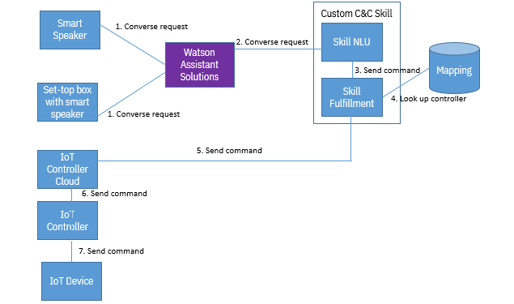

---
title: Command and control skills
weight: 10
---
A command and control skill allows users to control IoT devices from an assistant. 

In a single conversation, Watson Assistant Solutions can route user utterances between different skills. For example, a user might say "turn off the light" and then ask "what time is sunrise tomorrow". The command is routed to a room control skill and the question is routed to a time skill. You can design these skills to share context information, such as location, between them to enhance the conversation.

In deploying a command and control skill, Watson Assistant Solutions plays the part of routing requests to custom command and control skills. You must develop your own  custom skill and skill fulfillment web service and host both in your environment.  The custom skill and the skill fulfillment service are logically separate components but may reside on the same physical server.

The skill fulfillment service must be capable of the following:

- Receiving commands from command and control skills.
- Sending commands to an IoT platform, such as the Watson IoT platform.
- Supporting the messaging protocol that the IoT platform supports, for example, MQTT.
- Converting a text response from the skill into the form that is supported by the messaging protocol. 

#### User scenario

Jeff is in his hotel room, room number 44, and says "Out the overhead light". A speaker in the his hotel room captures the utterance and routes the command to Watson Assistant Solutions.  

Watson Assistant Solutions routes the command and the device ID of the speaker to a room control skill. The room control skill extracts the meaning of the utterance.  The skill sends a command to turn off the main light to the skill fulfillment service.

The fulfillment service looks up its IoT device mapping and determines that Jeff spoke to speaker 1 in his hotel room. 

The fulfillment service determines that the main light in room 44 is controlled by controller 1, which is on level 1. The fulfillment service routes the command to IoT controller 1. The IoT controller tells the main light to turn itself off.

#### IoT device mapping

As part of your fulfillment solution, you must create a mapping of IoT devices and IoT controllers.  You  might want to develop a user interface for managing your IoT device mapping.


Figure 1 displays the mapping between IoT devices and IoT controllers


When you create your IoT device mapping, adhere to the following rules:

- Each speaker is mapped to a single space.
- Each IoT device is mapped to a single space.
- Each IoT device has a single IoT controller.
- An IoT controller can manage multiple IoT devices.
- An IoT controller can manage multiple IoT device types, for example, a light and a fan.
- An IoT controller can reside in a different location to the IoT device it manages.  
- An IoT controller does not need to be mapped to a space.  However, it must be connected to the IOT devices it manages.
- A speaker must be associated with an IoT controller.  IoT controllers store the configuration details of the speakers that they can accept commands from.
- A speaker and the IOT device must be associated with the same IoT controller for a command to run.  


#### Sending the speaker ID

**Restriction**: You  must send the device ID of the speaker as part of the utterance context in the converse request from the client device to Watson Assistant Solutions. Parameters that are included under context are sent from Watson Assistant Solutions to skills. However, the client ID parameter, which refers to the same ID, is not sent to skills.

For example:

```
{ 
 "text": "Out the overhead light", 
 "language": "en-US", 
 "userID": "jeff-001", 
 "clientID": "romm-speaker-044", 
 "deviceType": "smart-speaker", 
 "additionalInformation": { 
  "context": { 
    "deviceID": "room-speaker-044"
    }
 }
}
```

#### Flow of commands

Figure 2 displays the flow of commands from the smart speaker to the IoT device.



The steps in this flow are as follows:

1. The smart speaker sends a converse request to Watson Assistant Solutions.
2. The core routing component sends a converse request to the command and control skill.
3. The skill extracts the command from the utterance and sends the command to your skill fulfillment service.
4. The skill fulfillment service uses the device ID that was sent in the converse request to indentify how to route to the IoT device. Specifically, the fulfillment service identifies the space that the speaker is in. From the space and device ID, it identifies the IoT device.  From the IoT device, it identifies the IoT controller cloud. 
5. The skill fulfillment service sends an MQTT message with the command and information about the IoT device to the IoT controller cloud.  
6. The IoT controller cloud routes the command and device information to the IoT controller.
7. The IoT controller sends the command to the IoT device.  The IoT device carries out the command.

#### Setting up your environment

Complete these steps:

1. Create and deploy your custom command and control skill.  Register your skill with Watson Assistant Solutions.  See the _Adding a custom skill_ topic for more information
2. Deploy your custom skill.
3. Create a skill fulfillment service.
4. Create an IoT device mapping.
5. Connect your IoT devices and IOT controllers.

**Note**: The steps are geared towards customers who have Watson Assistant for Industry or Watson Assistant for Automotive.