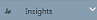

The Bot Analytics tool displays key metrics for your Watson Assistant Solutions assistant.  

### Starting the tool

Complete these steps:
1. On the console toolbar, click the Analytics menu.
 The home page is displayed.
2. In the Bot Analytics tool, click 
 to show the menu. The menu  is displayed.
3. Click .
4. Select a page. The pages provide the following insights:

    - Dashboard page: a snapshot of how your Watson Assistant Solutions tenant is behaving.
    - Basic page: high-level insights into user conversations.
    - Retention page: insights into your new and active users.
    - Conversation page: deeper insights into user conversations.
    - Intents page: insights into the volume of requests that were handled by intents.
    - Skills: insights into the volume of requests that were handled by skills.
    - Path Flow: insights into the typical flow of conversations.
5. Click  to hide the insights () menu.
 
### Filtering pages

You can filter the data on the page to narrow the scope to a skill or intent and to a specific time range. 

#### Setting the scope of the chart

The scope of the data in all of the charts is your Watson Assistant solutions assistant by default. 

With some charts, you can filter the data that is displayed in the graph or bar chart.

- To filter by skill, select a skill from the pull-down menu.  
- To filter by intent, select a skill and an intent from the pull-down menu.  

**Note**: Filtering is only applied to charts with (Skill, Intent) in their title.

For example:

#### Setting the time range

The default time period for each page is the last 30 days.  Use the slider to increase or decrease the time period. The maximum time period is the last 6 months (180 days).

> **What to do next?** 
Learn more about the metrics displayed [on each page]({{site.baseurl}}/analytics/analytics_pages).
