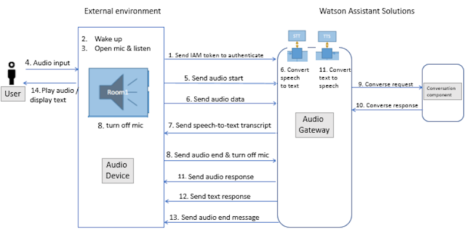

The flow for sending audio from an audio client through an audio gateway to your skills in Watson Assistant Soluitons is shown in figure 1.

Figure 1 - audio flow

 

The steps in this flow are as follows:
1. When it turns on, the audio client sends an IAM token to the audio gateway and the gateway authenticates the client.
2. The audio client processes a wake-up command.
3. The audio client opens its microphone and listens.
4. The audio client receives audio input from a user utterance.
5. The audio client sends an `audio start` message to the audio gateway.
6. For each chunk of binary audio data in the utterance, the audio client sends the audio that it captures in an `audio data` message. The audio gateway converts the audio input to text in real-time using a speech-to-text service.
7. The audio gateway sends `speech-to-text transcript` messages to the audio client.
8. The audio client sends an `audio end` message to the gateway. The audio client turns off its microphone.
9. The audio gateway forwards the text input to the routing core.
10. The routing core sends the utterance to the conversation component for evaluation and processing. The skill with the highest confidence processes the request and sends a response. The conversation component forwards the converse response from the skill to the audio gateway. For details of these steps, see [How routing works]({{site.baseurl}}/understand-service/how_it_works/).
11. If some or all of the response will be delivered to the user as audio, the audio gateway coverts the response from the routing core to audio using a text-to-speech service.  The gateway sends each chunk of binary audio data to the client in real-time.
12. If some or all of the response will be delivered as text, the audio gateway sends the text reply to the device.
13. The audio gateway sends an `audio end` message.
14. The audio client plays the audio response or displays the text response, or both. The audio client checks if the audio gateway set the prompt parameter to true in the audio end message. If true, the skill expects a response from the audio client, and the steps are repeated from step 3.  Otherwise the audio client waits for a new wake-up command.

> **What to do next?** 
Learn how [audio is processed with an audio controller]({{site.baseurl}}/audio/how_it_works_audio_controller).
