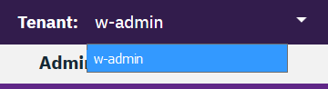

Depending on how your account is provisioned, you might have access to more than one tenant.

When you log in to the console, the name of the tenant you are viewing is displayed on the top bar of the window.

Managing a tenant involves the following tasks:

- [Change your view to a different tenant](#change-your-view-to-a-different-tenant)
- [Update a tenant configuration](#update-a-tenant-configuration)
- [Add a new user to your tenant](#add-a-new-user-to-your-tenant)
- [Removing a user from your tenant](#removing-a-user-from-your-tenant)

#### Change your view to a different tenant

If more that one tenant is provisioned for your deployment, click the down arrow to select a different tenant.

#### Update a tenant configuration

Complete these steps as an administrator to update a tenant configuration:

1. click **Admin** > **Usage** from the menu bar of the console. The summary table displays the list of tenants.
2. In the tenant summary view, click **Edit**.
3. Optionally, update the following fields:
    - `Tenant name`: Change the name that is displayed in the top bar.
    - `IBM Contact`: Provide an email address of the IBM contact person for the account.
    - `Contract end date`: Change the contact end date. Administrator privileges are required to edit this field.
4. Click **Save**.

#### Add a new user to your tenant

Adding a user

Complete these steps as an administrator to add a new user to your tenant:

1. Click **Admin** > **Add User by IBM id** from the console menu bar.
2. Click **Add User**. Enter one or more IBMids separated by commas.
3. Click Submit. 

#### Removing a user from your tenant

Adding a user

Complete these steps as an administrator to remove a new user from your tenant:

1. Click **Admin** > **Add User by IBM id** from the console menu bar.
2. Click **Delete** User. Enter one or more IBMids separated by commas.
3. Click submit. 

> **What to do next?** 
Learn how to [access your log data]({{site.baseurl}}/further-topics/get-logs/).
