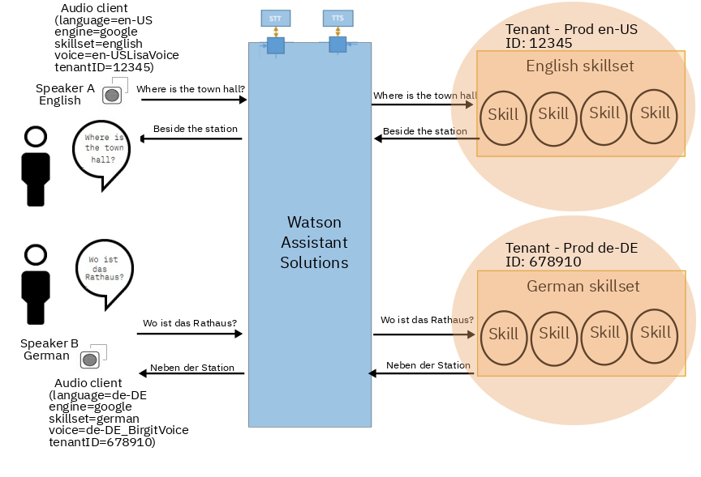

Out-of-the box, the built-in skills that are available with Watson Assistant Solutions are in English only.  However, Watson Assistant Solutions provides the building blocks for you to develop an assistant that supports multiple languages. 

### Conversing by text

In some assistants, users converse by text only.  To support multiple languages, add language support to your custom skills.  Follow these guidelines:

- Verify that the NLU engines support your chosen languages.  For the Watson Assistant NLU engine, see the [Supported languages](https://console.bluemix.net/docs/services/conversation/lang-support.html#changing-a-workspace-language) topic.
- Create a separate skill for each language.  For example, if your assistant provides an events skill, create a separate German events skill and an English events skill. 
- Use a single NLU engine for each skill. In each language version, the intent names, entity names, and dialog nodes must be in English.
- Create a skillset for each language.

Figure 1 shows two users conversing by text with an assistant.  The utterance in German is routed to the German skill, which is the skill that returns the highest confidence score. 

Figure 1 - Chat by text with a multi-language assistant

**Note**: You can specify the language in the [converse request](https://watson-personal-assistant.github.io/developer/reference/JSON_formats/#1-converse-request-from-a-client-device-to-the-routing-core) from the client device. However, the routing core does not currently use language in its routing algorithm.

### Conversing by voice

In many assistants, users converse by voice.  To add multi-langauge support, follow these guidelines:

- To accept audio input in multiple languages, verify that your STT engine, either [Google](ttps://cloud.google.com/speech-to-text/docs/languages) or [Watson](https://console.bluemix.net/docs/services/speech-to-text/index.html#about), supports your chosen languages.
- To provide audio responses, verify that the [Watson TTS engine](https://console.bluemix.net/docs/services/text-to-speech/http.html#voices) supports your chosen languages. 
- Determine what language each audio client will support. In its [configuration file](https://watson-personal-assistant.github.io/developer/audio/config_properties/), specify the language, the STT engine and the TTS voice to use.
- Add language support to your custom skills. See the [Conversing by text](#conversing-by-text) section.

Figure 2 shows two users conversing with an assistant by audio.  The utterance in German is routed from speaker B to the STT engine for conversion to text. Next, it is routed to the German skillset.  The response is routed to the TTS engine.  The speaker plays back the response in German.

Figure 2 - Chat by voice with a multi-langauge assistant

> **What to do next?** 
[Access the Watson Assistant Solutions service]({{site.baseurl}}/get-started/get-api-key).
