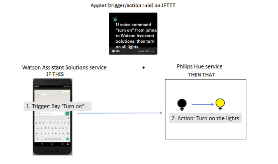

IFTTT (If This, Then That) is a software platform that you can use to automate the connection between your Watson Assistant Solutions service and the services from other providers.  To set up automated connections, a registered end-user creates an applet on the IFTTT platform.  The applet  connects a trigger (if this) with an action (then that).  For example, you can create an IFTTT applet that connects a Watson Assistant Solutions service with a Philips Hue service (see figure 1). 

Figure 1 – Connecting the Watson Assistant Solutions service with a Philips Hue Service

The trigger is an utterance made to your Watson Assistant Solutions assistant to “turn on the lights”.  The action is to turn on the lights using the Philips Hue service. 

The integration of Watson Assistant Solutions with the IFTTT platform is in alpha mode.  Initially, you can use Watson Assistant Solutions as the trigger and an external service on IFTTT as the action.  For more information about using IFTTT, see [IFTTT platform documentation](https://platform.ifttt.com/docs).

> **What to do next?** 
Read more about [how IFTTT rules work]({{site.baseurl}}/ifttt/how_ifttt_works).
