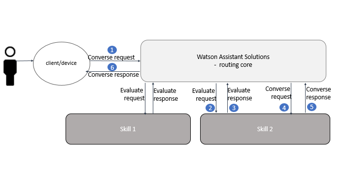

---
JSON structure
---
In your custom skills, communication between your client device, the core routing component of Watson Assistant Solutions, and your custom skills is implemented using evaluate and converse methods.  

In figure 1, the flow of a conversation between your client device and your assistant is displayed. For more informaton about the flow of the converation, see the _How routing works_ topic.  

Figure 1 - conversation flow


In sections 1 to 6, an example of the JSON structure at each step in the flow is presented.

The following high-level scenario is captured in the JSON examples:

### Scenario
John has registered his family to use an assistant named Watson.  John is currently at his home in London and is planning to travel to the city center if the temperature does not get too hot. He says "hello Watson" to wake up his device in the kitchen, and asks "What are the temperatures like today in London city center".  

Internally, some context information is set as the request flows through Watson Assistant Solutions to a weather skill.  In the utterance context, $location is set to at-home.  In response to an evaluation or converse context, the weather skill adds $weather_interest to the skill context and sets it to temperature.  In the session context, the skill sets $zone  to city-center.  

In its response, the weather skill responds with "In London city center, low temperature today will be 83 degrees fahrenheit and high temperature today will be 109 degrees fahrenheit".  Because John is at home, the skill also returns a card with a URL to a temperature map for London city.  The device displays the temperature map.

---
### 1. Converse request from a client device to the routing core

The JSON structure of the converse request from the client device to the routing core is as follows:

```JAVASCRIPT
{
  "text": "What are the temperatures like today in London city center",
  "language": "en-US",
  "userID": "john-001",
  "clientID": "home-speaker-001",
  "deviceType": "smart-speaker",
  "additionalInformation": {
    "context": {
      "location": "at-home"
    }
  }
}
  
```

Table 1 - Converse request parameters

Parameter | Description | Type | Required
---------|----------|---------|---------
 `text` | The user utterance. | string | yes
 `language` | The language that the user utterance is in.  | string | yes
 `userID` | The ID of the end-user who made the utterance.  For example, three people might share a car.  The user ID might be the name of the person who is currently driving the car. | string | yes
 `clientID` | The ID of the client device.  For example, in a car, the client ID might be the ID of the smart speaker that is built into the car.  | string | no
 `deviceType` | A value that represents the type of client or device from where the utterance was sent.| string | yes
 `Additional information` | Extra information about the context of the conversation. Only information that is added to the context object is sent to the skill.| object | yes

 Table 2 - Converse request parameters - Additional information

 Parameter | Description | Type | Required
---------|----------|---------|---------
 `context` | The utterance context. For example, the utterance context might capture whether a user is at home or in his car. A skill might use a different response depending on the utterance context. When a user is at home and asks about expected temperatures, the skill might return a temperature map with the response. When the user is in the car, the temperatur map is not returned.  An empty context object is allowed.| object | yes
---

### 2. Evaluate request from the routing core to the skills

The JSON structure of the evaluate request from the routing core to the skills is as follows:

```JAVASCRIPT
{
  "id": "001",
  "version": "1.0",
  "language": "en-US",
  "text": "What are the temperatures like today in London city center",
  "context": {
    "user": {
      "id": "john-001"
    },
    "session": {
      "id": "session-001",
      "new": "true",
      "attributes": {}
      "version": "1.0"
    },
    "application": {
      "id": "app-001",
      "attributes": {
        "location": "at-home"
      }
    }
  }
}

```

Table 3 - Evaluate request parameters

Parameter | Description |
---------|----------
 `id` | The request ID.|
 `version` | The request version.  |
 `language` | The language that the user utterance is in. | 
 `text` | The user utterance after the routing core has normalized the text. |
 `context` | Information about the context of the conversation with the user.|

Table 4 - Evaluate request parameters - context 

 Parameter | Description |
---------|----------|
 `user` | The user ID.  |
 `session` | Information about the session.  |
 `application` | The application ID and any utterance context information.  |

Table 5 -  Evaluate request parameters - user context

Parameter | Description |
---------|----------|
 `id` | The unique ID of the user.  |

 Table 6 - Evaluate request parameters - session context 

Parameter | Description | Type | Required
---------|----------|---------|---------
 `id`  | The ID of the session. |
 `new` | Specifies whether this session with the user is a new session. If a conversation with the user is already in progress `new` can be set to `false`.  |
 `attributes` | Includes  information about the session. |
 `version`  | The version of the session.   |

 Table 7 -  Converse request parameters - application context

Parameter | Description | 
---------|----------|-
 `id` | The unique ID of the application. |
 `attributes` | Includes attributes representing utternace context information. |

Table 8 -  Converse request parameters - application attributes

Parameter | Description | 
---------|----------|-
 `attributes` | Includes any utternace context information. 

---
### 3. Evaluate response from the skill to the routing core 

The JSON structure of the evaluate response from a skill to the routing core is as follows:

```JAVASCRIPT
{
  "responseCode": 200,
  "requestResult": "In London city center, low temperature today will be 83 degrees fahrenheit and high temperature today will be 109 degrees fahrenheit.",
  "handleUtterance": true,
  "context": {
    "user": {
      "id": "john-001"
    },
    "session": {
      "id": "session-001",
      "new": "true",
      "skill": {
        "attributes": {
          "weather-interest": "temperature"
          }
      },
      "attributes": {
        "zone": "city-center"
        },
      "version": "1.0"
    },
    "application": {
      "id": "app-001",
      "attributes": {
        "location": "at-home"
      }
    }
  },
 "intentities": [
     {
      "name": "wcs",
      "entities": [
        {
          "entity": "weatherType",
          "value": "temperature",
          "confidence": 1
        },
        {
          "entity": "datePhrase",
          "value": "today",
          "confidence": 1
        },
        {
          "entity": "sys-location",
          "value": "london",
          "confidence": 0.962316
        }
      ],
      "intents": [
        {
          "intent": "get-temperature",
          "confidence": 0.85514235496521
        },
        {
          "intent": "get-forecast",
          "confidence": 0.75514235496521
                }
            ]
        },
     {
      "name": "regexp",
      "entities": [
        {
          "entity": "sys-location",
          "value": "london",
          "confidence": 0.941245
        }
      ],
      "intents": [
        {
          "intent": "get-temperature",
          "confidence": 0.83214235496521
        },
        {
          "intent": "get-forecast",
          "confidence": 0.73914235496521
                }
            ]
        }
    ]
}
```

Table 9 - Evaluate response parameters 

Parameter | Description | Type | Required
---------|----------|---------|---------
 `responseCode` | The status of the response. For example,  200 (OK) or 400 (bad request) | string | yes
 `requestResult` | The response to the utterance if returned by the NLU engine. The regexp nlu engine does not return a response in an evaluation response. | string | yes
 `handleUtterance` | Set to false if the skill is capable of handling the utterance but decides not to handle it.  For example, a skill is designed to only display a map when the user is at home.  When the skill detects that the user in  a car, it sets `handleUtterance` to false.   | boolean  | yes
 `context` | Information about the context of the conversation with the user. | object | yes
 `intentities` | The intents and entities returned by the skill for each NLU engine. | array | yes

 Table 10 - Evaluate response parameters - context

 Parameter | Description | Type | Required
---------|----------|---------|---------
 `user` | The user ID. | string | yes
 `session` | Information about the session, including session context information. | object | yes
 `application` | The application ID and utterance context information.  | object | yes

Table 11 -  Evaluate response parameters - user context

Parameter | Description |
---------|----------|
 `id` | The unique ID of the user.  | string | yes

 Table 12 - Evaluate response parameters - session context 

Parameter | Description | Type | Required
---------|----------|---------|---------
 `id`  | The ID of the session. | string | yes
 `new` | Specifies whether the session with the user is a new session.   | string | yes
 `skill` | Includes attributes representing the skill context | object | yes
 `attributes` |  Includes any session context information. | object |  yes
 `version`  | The version of the session. Set to `1.0`.  | string | yes 

Table 13 -  Evaluate response parameters - skill context

Parameter | Description |
---------|----------|
 `attributes`  | Includes any skill context information. | object | yes |

Table 14 -  Evaluate response parameters - application context

Parameter | Description | Type | Required
---------|----------|---------|---------
 `id` |  The unique ID of the application. | string | yes
 `attributes` | Includes any utternace context information. | object | yes

 Table 15 -  Converse request parameters - application attributes

Parameter | Description | 
---------|----------|-
 `attributes` | Includes any utternace context information. 

Table 16 - Evaluate response parameters - Intentites 

Parameter | Description | Type | Required
---------|----------|---------|---------
 `name` | The NLU type that process the evaluation request | string | yes
 `entities` | The entities returned by the NLU engine that matched the utterance. | array | no
 `intents` | The intents returned by the NLU engine that matched the utterance. | array | no

Table 17 - Evaluate response parameters - Entities 

Parameter | Description | Type | Required
---------|----------|---------|---------
 `entity` | The name of an entity extracted from the utterance by the NLU engine. | string | yes
 `value` | The value of the extracted entity. | string | yes
 `confidence` | A confidence value that is associated the entity value. | string | yes 

Table 18 - Evaluate response parameters - Intents 

Parameter | Description | Type | Required
---------|----------|---------|---------
 `intent` | The name of an intent that matches the utterance. | string | yes
 `confidence` | A confidence value that is associated the intent. | string | yes

### 4. Converse request from the routing core to the skill

The JSON structure of the converse request from the routing core to a skill is as follows:

```JAVASCRIPT
{
  "id": "001",
  "version": "1.0",
  "language": "en-US",
  "text": "What are the temperatures like today in London city center",
  "retext": "what are the temperatures like today in the city center",
  "attributes": {
    "intent": "get-temperature"
  },
  "context": {
    "user": {
      "id": "john-001"
    },
    "session": {
      "id": "string",
      "new": "true",
      "skill": {
        "attributes": {
          "weather-interest": "temperature"
          }
      },
      "attributes": {
        "zone": "city-center"
        },
      "version": "1.0"
      },
    "application" : {
      "id": "app-001",
      "attributes": {
        "location": "at-home"
      }
    }
  }
}

```

Table 19 - Converse request parameters

Parameter | Description |
---------|----------|
 `id` | The request ID. |
 `version` | The request version. Set to `1.0`.  |
 `language` | The language that the user utterance is in.   |
 `text` | The user utterance. |
 `retext` | The user utterance after the routing core has normalized the text. |
 `attributes` | A reference to the intent with the higest confidence score that was returned by the skill. |
 `context` | Information about the context of the conversation with the user. |

Table 20 - Converse request parameters - attributes

 Parameter | Description |
---------|----------|
 `intent` | The name of the intent with the highest confidence score. |

Table 21 - Converse request parameters - context

 Parameter | Description |
---------|----------|
 `user` | The user ID. |
 `session` | Information about the session. |
 `application` | The application ID and any utterance context information. |

Table 22 -  Converse request parameters - user context
Parameter | Description |
---------|----------|
 `id` | The unique ID of the user. |

Table 23 - Converse request parameters - session context

Parameter | Description |
---------|----------|
 `skill`  | The ID of the session. |
 `new` | Specifies whether this session with the user is a new session. If a conversation with the user is already in progress `new` can be set to `false`.  |
 `skill` | Includes attributes representing the skill context | object | yes
 `attributes` |  Includes any session context information. | object |  yes
 `version`  | The version of the session. Set to `1.0`.  | string | yes 

Table 24 -  Evaluate response parameters - skill context

Parameter | Description |
---------|----------|
 `attributes`  | Includes any skill context information. | object | yes |

Table 25 -  Converse request parameters - application context

Parameter | Description | 
---------|----------|-
 `id` | The unique ID of the application. |
 `attributes` | Includes attributes representing utternace context information. |

Table 26 -  Converse request parameters - application attributes

Parameter | Description |
---------|----------|-
 `attributes` | Includes any utternace context information. |
---

### 5. Converse response from the skill to the routing core
The JSON structure of the converse response from a skill to the routing core is as follows:

```JAVASCRIPT
{
  "reject": false,
  "error": 200,
  "deleteSkillSession": false,
  "captureInput": false,
  "speech": {
    "text": "In London city center, low temperature today will be 83 degrees fahrenheit and high temperature today will be 109 degrees fahrenheit."
  },
  "card": {
    "type": "show-temp-map",
    "content": [
      {
        "image_url": "https://www.bbc.co.uk/weather/2643743"
      }
     ]
  },
  "skill": {
    "name": "weather",
    "intents": [
      {
        "intent": "get-temperature",
        "confidence": 85514235496521
      }
    ],
    "entities": [
      {
        "entity": "weatherType",
        "value": "temperature",
        "confidence": 1
        },
        {
          "entity": "datePhrase",
          "value": "today",
          "confidence": 1
        },
        {
          "entity": "sys-location",
          "value": "london",
          "confidence": 0.962316
        }
    ],
    "confidence": 85514235496521
  },
  "additionalInformation": {
    "context": {
      "application": {
        "id": "app-001",
        "attributes": {
          "location": "at-home"
          }
      },
      "session": {
        "id": "session-001",
        "new": "true",
        "skill": {
            "attributes": {
              "weather-interest": "temperature",
              "inConversation": "false"
              }
            },
        "attributes": {
          "zone": "city-center"
      },
      "version": "1.0"
      }
    }
  }
}
```
Table 27 - Converse response parameters

Parameter | Description | Type | Required
---------|----------|---------|---------
 `reject` | Specifies that the skill has rejected the request. | boolean | yes
 `error` |  The status of the response. For example, 200 (OK) or 404 (not found). | string | yes
 `deleteSkillSession` | Instructs the routing core to end the user session. When the user session is ended, the context information that is stored is deleted. | boolean | yes
 `captureInput` | Instructs the audio client to continue to listen for an utterance.  If set to tue, the audio client should not wait for a wake-up command. | boolean | yes
 `speech` | The response from the skill. | object |  yes
 `card` | A card provides supplementary information that enhances the text response.  You might use a card to display an image, play music, or provide a more detailed text response. In the card object, you provide the URL to the image or music.  The client device determines how to present this information to the user. | object |  no
 `skill` | Information about the skill that processed the response. | object | yes 
 `additionalInformation` | Additional information about the conversation, including context information and whether the skill is in conversation. | object | yes

Table 28 - Converse response parameters - speech

Parameter | Description | Type | Required
---------|----------|---------|---------
 `text` | The response from the skill.  | string | yes

Table 29 - Converse response parameters - card

Parameter | Description | Type | Required
---------|----------|---------|---------
 `type` | The action that the card provides.  In the example, the action is named `show-temp-map`.  The card is used to display a temperature map when the user is at home.   | string | yes
 `content` | Supplementary information to enhance the response. Add attributes to represent the information.  For example, you might add `image-url` or `music-url` to specify the image to display or the music to play.  | object | yes

Table 30 - Converse response parameters - skill

 Parameter | Description | Type | Required
---------|----------|---------|---------
 `name` | The name of the skill. | string | yes
 `entities` | The entities that were extracted from the utterance. | array | yes
 `intents` | The intent that processed the utterance. | array | yes
 `confidence` | The confidence score of the intent or entity that processed the request. | string | yes

Table 31 - Converse response parameters - intents 

Parameter | Description | Type | Required
---------|----------|---------|---------
 `intent` | The name of the intent that processed the utterance. | string | yes
 `confidence` | The confidence score of the intent that processed the utterance | string | yes

Table 32 - Converse response parameters - additional information 

 Parameter | Description | Type | Required
---------|----------|---------|---------
 `context` | Information about the context of the conversation with the user.  | object | yes

Table 33 - Converse response parameters - response context 

 Parameter | Description | Type | Required
---------|----------|---------|---------
 `application` | The application ID and utterance context information.| object | yes
 `session` | Information about the session, including session context information and skill context information.  | object | yes


Table 34 - Converse response parameters - Application context 

Parameter | Description | Type | Required
---------|----------|---------|---------
 `id` | The unique ID of the application. | string | yes
 `attributes` | Includes any utternace context information. | object | yes

Table 35 - Converse response parameters - Session context 

Parameter | Description | Type | Required
---------|----------|---------|---------
 `skill` |  Includes any skill context attributes. | object | yes 
 `attributes` |   Includes any session context attributes. | object | yes
 `inConversation` | Specifies whether the skill is expecting a response from the end-user.  Allows the response from the user to be routed to the same skill for processing.  | boolean | yes
 `version` |The version of the session. Set to `1.0`. | yes

Table 36 - Converse response parameters - skill context 

Parameter | Description | Type | Required
---------|----------|---------|---------
 `attributes` | Attributes representing the skill context information. | object | no


### 6. Converse response from the routing core to a client device
The JSON structure of the converse response from the routing core to a client device is as follows:

```JAVASCRIPT
{
  "requestID": "?",
  "captureInput": "true",
  "speech": {
    "text": "In London city center, low temperature today will be 83 degrees fahrenheit and high temperature today will be 109 degrees fahrenheit.",
  }
  "additionalInformaton": {
    "context": {
      "location": "at-home"
      }
    }
  }
}
  
```

Table 37 - Converse response parameters

Parameter | Description |
---------|----------|
 `requestID` | The ID of the request. |
 `captureInput` | Specifies whether an audio client must continue to listen for an utterance.  If set to true, the audio client does not wait for a wake-up command.   |
 `speech` |  The response to the utterance. |
 `Additional information` | Extra information context inforamtion about the conversation. Only context information is sent to the skill.|

Table 38 - Converse request parameters - speech

Parameter | Description |
---------|----------
 `text` | The response to the utterance. |

 Table 39 - Converse request parameters - Additonal information

 Parameter | Description |
---------|----------|
 `context` | Contains the utterance context. | 
---
