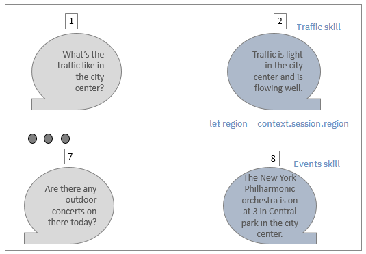
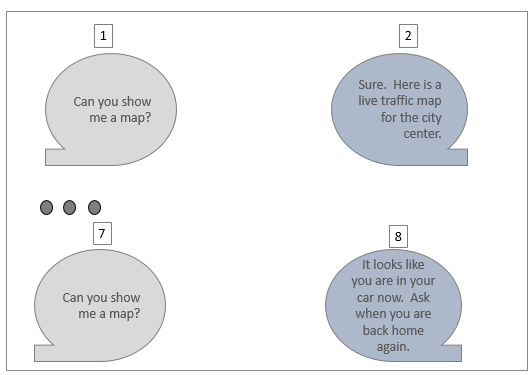

Watson Assistant Solutions provides several features you can use to enhance the conversation between your end-users and your skill and to personalize the conversation.

These include:
- [Setting an _in conversation_ flag](#setting-an-in-conversation-flag)
    - [Sample code](#sample-code)
- [Routing by intents or entities](#routing-by-intents-or-entities)
- [Routing by skill context](#routing-by-skill-context)
- [Routing by session context](#routing-by-session-context)
- [Updating the built-in context using the Context REST API](#updating-the-built-in-context-using-the-context-rest-api)
    - [Accessing specific parameters](#accessing-specific-parameters)
- [Routing by utterance context and rejecting utterances](#routing-by-utterance-context-and-rejecting-utterances)
    - [Sample code](#sample-code)
- [Handling unmatched utterances with fallback skills](#handling-unmatched-utterances-with-fallback-skills)
- [Reusing evaluation results](#reusing-evaluation-results)
- [Sending extra information in cards](#sending-extra-information-in-cards)


The examples in this topic are based on an assistant with three custom skills:
- a traffic skill
- an events skill
- a fallback skill

#### Setting an _in conversation_ flag
During a conversation, a skill may prompt for more information from the end-user to assist with routing.
For example:

_Figure 1 - setting the in conversation flag_


In figure 1, the traffic skill asks the user which region the user wants the traffic news for.  The traffic skill sets an in conversation flag to notify the Watson Assistant Solutions routing core that it is in a conversation and that it is expecting a response. Otherwise, another skill, such the events skill, might return a higher confidence score and process the utterance.

##### Sample code
```javascript
//The 'in conversation' flag is set to True
'get-traffic': (request, response, context) => {
    response.setInConversation(true);
    response.deleteSkillSession(false).say('In the city center or suburbs').send();
},
```

#### Routing by intents or entities
You can route the conversation using intents.  In your skill, you can define responses to give when specific intents are detected in the utterance.

_Figure 2 - routing by intent_


In figure 2, the `#get_roadworks` intent is detected and a list of roadworks is provided in the response.

You can also route the conversation using entities.  For example:
- You might route on an entity that is provided in an utterance.
- You might route on an entity if only an entity is provided in the utterance.

_Figure 3 - routing by entities_


In figure 3, the routing core routes based on a `@trafficarea` entity.  A different response is provided depending on whether the value is city center or suburbs.

When routing by entities, in the `actions.js` file, actions in the entities section of the file are called.  For example:
```javascript
// pre processing for entity based routing
entities: (request, response, context) => {
    handler.converse(request, response, context, converseCallback);
},
```

To avoid mishandling by skills, you can disable entity-based routing in the manifest file of your skills.  Set `routeByEntities` to `false`. Then, when it is appropriate to route by entities, enable the capability under specific conditions in the evaluation response in your skill code. For example:

```javascript
let evaluationCallback = function(results, evaluationResponse, context, err) {
    if(err) {
        console.error(err);
    else {
        if(!result) {
            result =['Nlu engine did not return an output'];
        }
        evaluationResponse.setRoutingbyEntities(true).send(result[0]);
        }
    }
}

```
Alternatively, if your skill uses the Watson Assistant NLU, you can set `routeByEntities` to `true` in the context, and the skill SDK overrides the value that you set in the manifest file.

For example:


Scenario:

You might want your skill to enable routing by entities when the skill is expecting the user to respond with an entity value.  When a restaurant skill asks "How many people is your booking for", the restaurant skill expects only an entity to be returned.  The skill enables entity-based routing for the evaluation response.  Then, when the user responds with "12 people", the restaurant skills provides an evaluation response with a strong match for the entity `@numberofpeople`.  In this scenario, the routing core routes to the restaurant skill using entity-based routing.

#### Routing by skill context
You can use context variables when you evaluate a request. For example:
- You can specify that a condition is evaluated if the context variable expression you specify is true.
- You can use context variables to determine what response to give.

_Figure 4 - routing by skill context_


In figure 4, the end-user asks about traffic diversions.  At step 2, the skill sets `$traffic_interest` variable to diversions.  Later in the conversation, when the user asks to see a map at step 7, the skill checks the `$traffic_interest` variable and responds with a map of roadworks and diversions.

The skill context is saved by Watson Assistant Solutions and can be passed to a Watson Assistant (formerly Watson Conversation) workspace. Information is saved in the skill context for one month.

#### Routing by session context
Variables that are set in the session context are available to all skills.

_Figure 5 - routing by session context_



In figure 5, at step 2, the traffic skill saves the region of interest, Central Park, to a `$region` variable in the session context. Later in the conversation at step 7, the user asks "Are there any outdoor concerts on there today".  The utterance is routed to a different skill this time.  The events skill returns the highest confidence score. The events skill uses the `$region` variable to determine what response to provide to the utterance.  The events skill returns a response based on the Central Park region.

Information is saved in the session context for one month.

#### Routing by utterance context and rejecting utterances
A skill can use the utterance context when it evaluates a request and when it determines a response. For example, an utterance might include a `$location` variable that is either set to `car` or `atHome`.

In certain circumstances, you might want the skill to reject an utterance that it is equipped to handle.  For example, the traffic skill is designed to handle the `#get_map` intent. The goal of this intent is to display a live traffic map.  On evaluation, the skill returns a confidence level above its threshold value. However, you want the traffic skill to display a map if the user is at home and not if they are in their car.  You can design your skill to call the reject utterance function in the evaluation request.

_Figure 8 - reject utterance per utterance context_



In figure 8, when `$location` in utterance context is set to _at home_, the evaluation request is processed. Later in the conversation, when `$location` in utterance context is set to _in the car_, the evaluation request is rejected.
**Note**: The `$location` variable is set by the app that is running in the car or the house, that is, the app that is sending the request.

##### Sample code
```javascript
//Example of rejecting an utterance evaluation request based on utterance context
evaluation: (request, evaluationResponse, context) => {
    if (context.utterance.location && context.utterance.location !== 'car') {
        evaluationResponse.rejectUtterance().send();
    }
    else {
        handler.evaluateRequest(request, evaluationResponse, context, evaluationCallback);
    },
},
```
Information in the utterance context is not saved.

#### Handling unmatched utterances with fallback skills
No matter how broad a knowledge base your assistant has, circumstances will arise that your skills do not have the knowledge to handle.  In your responses, you can provide a more elegant response than "I'm not trained for this".

_Figure 9 - routing to a fallback skill_


In figure 9 at step 2, the user is reminded of the type of questions to ask.

Define fallback skills to capture these circumstances. Design your fallback skills to capture most utterances and to return a high confidence score for any utterance.

To configure a fallback skill, complete these steps:

1.  Create a fallback skill, add fallback intents to the skill, and associate actions with these intents. <br>**Important**: Create fallback intents that are broad enough to capture most utterances and are likely to return a high confidence score for any utterance.
2.  Add the skill to a skill set and tag it as a fallback skill.  For example, in skillsData, set:
```json
{
  "fallback": true,
  "skillNames": [
    "place-skill-name-here"
  ]
}
```
A fallback skill is created.

#### Reusing evaluation results
In response to an evaluation request from the routing core, your skill might return the skills response to the user utterance in the `evaluationResponse` object.  You might want to use these results and avoid an extra converse request to your skill.

Sample code:
```javascript
{
  'yes': (request, response, context) => {
      handler.saveEvaluationContext(context, request.evaluationResponse.context)
      response.say(request.evaluationResponse.response).deleteSkillSession(true)
  }
}
```
To persist context information, the handler function copies the context information from the evaluation response object to the context object. 

#### Sending extra information in cards

In a converse response, your skill returns text. You can enhance the text by returning extra information in a card.  

Typically, a card is used to return more verbose text, to display a graphic, or to play music.  

For example, the traffic skill returns an image of a live traffic map of the city center to the client device. The client device determines how this image is rendered to the user.  The text "Sure. Here is a live traffic map for the city center." is also returned to the client device.

Figure 10 - sending a card in the converse response


Sample code:
```javascript

response.card('some action', {"some", "json"}),
```

**Note** Only one card object can be sent per converse response.

> **What to do next?**<br/>
Learn about the [skills that are available with Watson Assistant for Industry]({{site.baseurl}}.baseurl}}/flavours/industry).
